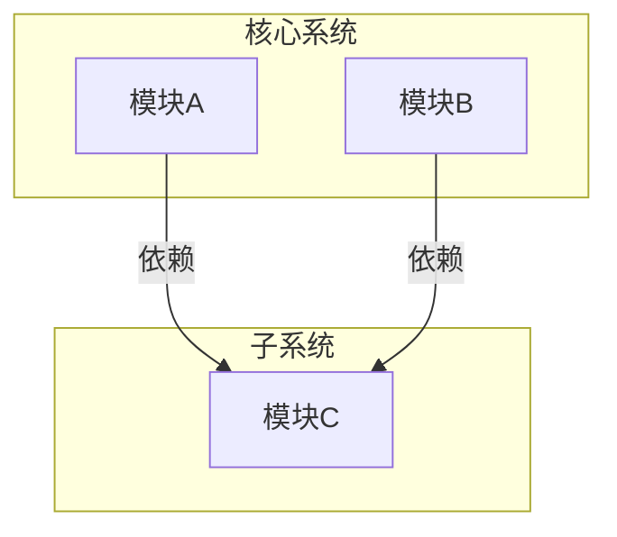
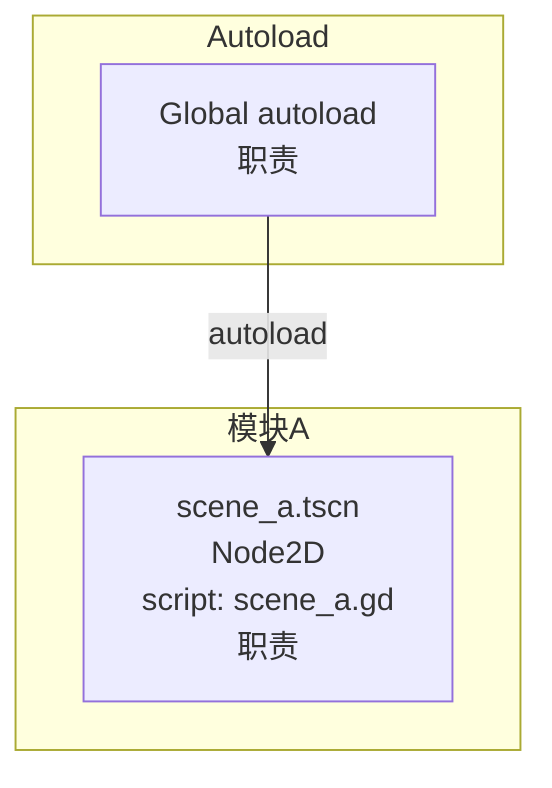

# Godot 项目级 architecture.md 格式规范

此文件定义项目级 `architecture.md` 的输出格式。architecture skill 的 `--init` 和 `--update` 模式按此模板产出。

项目级 architecture.md 描述项目**当前**的完整架构状态。每次 feat 完成后通过 `--update` 合并更新。

## 模板

```markdown
# 项目架构

## 1. 模块关系图

Mermaid flowchart。项目全量模块及其依赖关系。



## 2. 领域模型实现

全量模块的领域模式 → Godot 实现策略。

### 2.1 {模块名}

**领域模式：** {FSM / 资源管理 / ...}

**实现策略：**

| 领域规则 | Godot 实现 | 所在位置 |
|----------|-----------|---------|
| 规则 1 | 构造 1 | 文件:脚本 |
| 规则 2 | 构造 2 | 文件:脚本 |

**关键数据结构：**

```
script_name.gd:
  variable: Type    — 语义
```

**状态机（如含 FSM）：**

Mermaid stateDiagram-v2。

### 2.2 {模块名}
...

## 3. 系统全景图

### 3.1 完整运行时节点树

Mermaid flowchart。整个游戏运行时的完整节点树。

- 用 `subgraph` 标注模块边界
- 每个节点标注：文件名、节点类型、脚本名、职责
- 连线标注创建方式



### 3.2 关键信号序列图

项目级只保留最核心的跨模块信号流（启动流程、核心交互链路）。

## 4. 对外接口

全量跨模块接口。不列模块内部方法。

| 模块 | 方向 | 接口 | 完整签名 | 调用方 | 时机 |
|------|------|------|---------|--------|------|
| 模块A | 对外暴露 | signal_name | signal_name(param: Type) | 模块B | 时机 |
| 模块A | 外部依赖 | ModuleB.method | method(param: Type) -> ReturnType | — | 时机 |

## 5. 渲染策略

- Camera2D/3D 绑定策略
- CanvasLayer 层级定义
- 视口缩放策略

## 6. 初始化顺序

全局 autoload 初始化链 + 根场景 _ready() 关键顺序。

```
Autoload 初始化顺序:
  Save → Global → CharacterStates → ...

根场景 _ready():
  Level._ready():
    1. ...
    2. ...
```

## 7. 跨模块约定

全量累积的模块间协作规则。

- 约定 1：说明
- 约定 2：说明
```

---

## 内容规则

**必须遵守：**
- 每个 scene 标注创建方式（编译期嵌套 / 运行时 instantiate / autoload）
- 序列图标注到 `节点.脚本.方法()` 或 `节点.signal` 级别
- 实现策略表每行一条规则
- 对外接口只列跨模块边界的接口

**禁止内容：**
- 单个 scene 的内部节点树展开
- 节点属性默认值
- 动画帧索引和 method track 定义
- 资产声明
- GDScript 代码片段
- 文件路径（scene 文件名除外）
- feat-N 标注——项目级始终反映当前状态，不是变更日志
