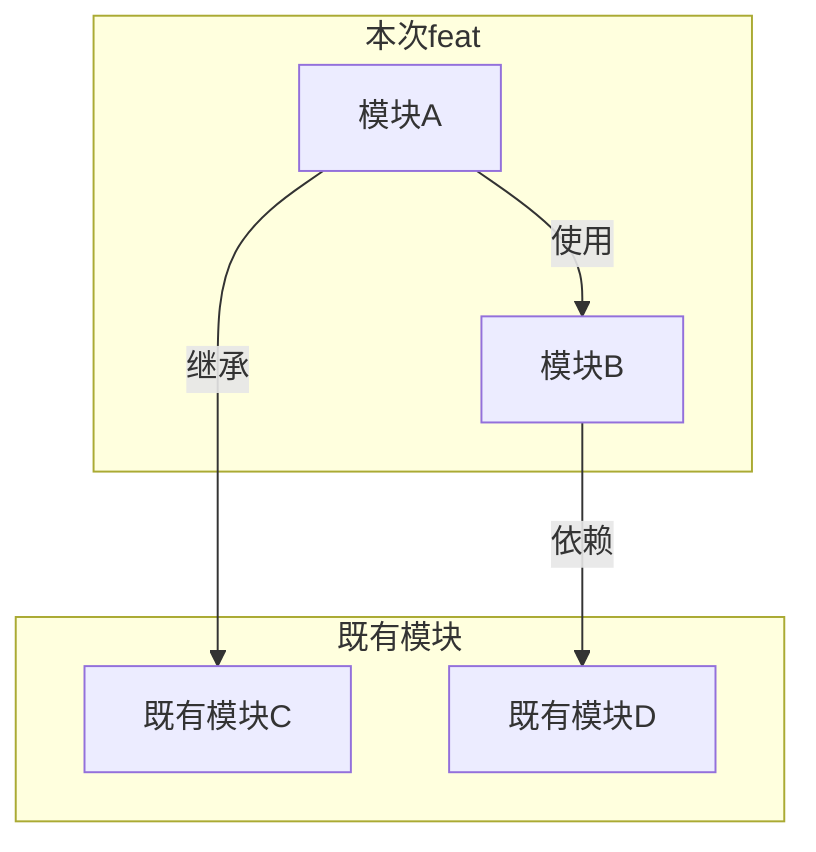
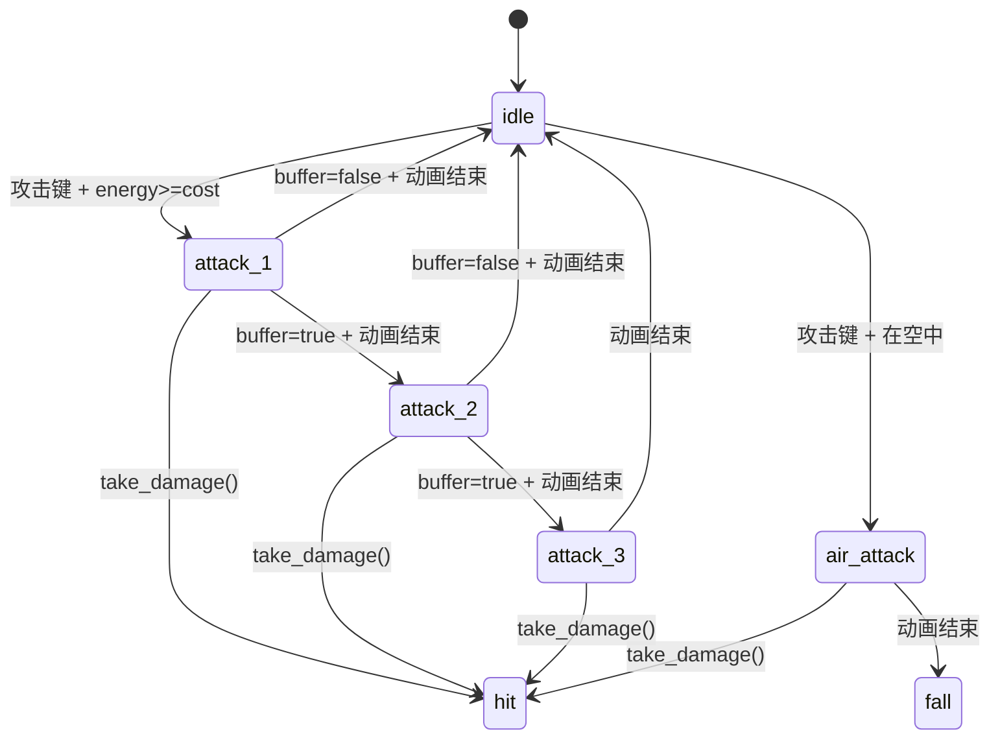
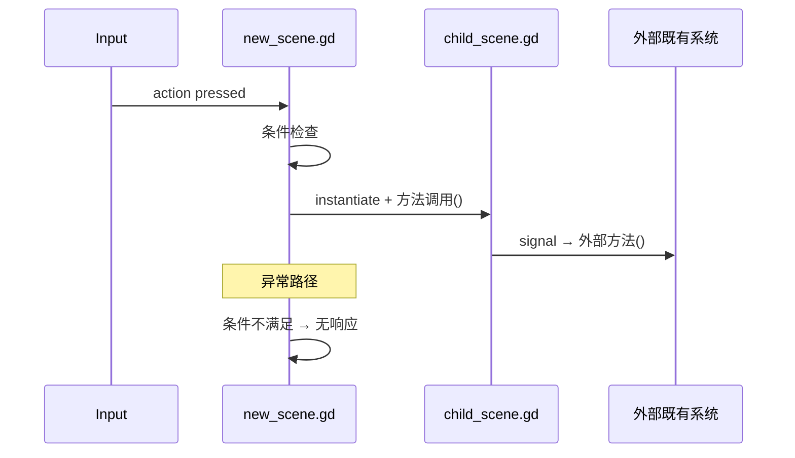

# Godot architecture.md 格式规范

此文件定义 godot `architecture.md` 的输出格式。architecture skill 的 `--task` 模式按此模板产出。
architecture 的职责是**描述 scene 之间的关系**——有哪些 scene、怎么装配、信号怎么流。

## 核心原则

- **scene 是一等公民。** Godot 以场景树为骨架，架构文档必须描述完整的运行时节点树。
- **写 scene 之间的关系，不写 scene 内部细节。**
- **标注创建方式。** 每个 scene 必须标注编译期嵌套、运行时 instantiate、还是 autoload。

## 模板

```markdown
# 架构设计

## 1. 模块关系图

Mermaid flowchart。本次 feat 的模块（来自 domain-design）与既有项目模块之间的抽象依赖关系。

一个节点 = 一个领域功能模块，不展开为 scene。给 exec 拆分 task 和决定执行顺序用。



## 2. 领域模型实现

domain-design 识别了每个模块的领域模式（FSM、资源管理、事件队列……）和核心规则。本章回答：**这些模式在 Godot 里具体用什么构造来实现。**

对 domain-design 的每个模块，写一小节：

### 2.1 {模块名}

**领域模式：** {从 domain-design 引用——这是什么模式}

**实现策略：**

每条对应 domain-design 的一条核心规则，写清楚在 Godot 里用什么构造落地：

| 领域规则 | Godot 实现 | 所在位置 |
|----------|-----------|---------|
| combo 段位追踪(0-3) | `combo_count: int` 变量 | cyber_tang_hero.gd |
| 段位间推进(攻击键窗口期内续按) | `attack_buffer: bool` + `ComboWindowTimer` | cyber_tang_hero.gd |
| 刀光帧精确启用/禁用 | AnimationPlayer method track 调用 `_enable_hitbox()` / `_disable_hitbox()` | cyber_tang_hero.tscn 的 AnimationPlayer |
| 能量消耗与回复 | `energy -= cost` + `RestoreEnergyTimer(5s)` → `_restore_energy()` | cyber_tang_hero.gd |
| 武器切换(攻击中排队) | `pending_weapon_index: int` + `_apply_weapon_switch()` 在 animation_finished 中调用 | cyber_tang_hero.gd |
| 刀光伤害判定 | `Area2D.body_entered` signal → `body.take_damage(damage, direction)` | slash_hitbox.gd |

**关键数据结构：**

列出跨方法使用的核心变量/配置（不写默认值，只写语义）：

```
cyber_tang_hero.gd:
  combo_count: int (0-3)          — 当前combo段位
  attack_buffer: bool              — 输入缓冲标记
  pending_weapon_index: int        — 等待切换的武器索引
  energy: float                    — 当前能量

slash_hitbox.gd:
  damage: int                      — 本次攻击伤害值
  hit_targets: Array[Node2D]       — 已命中目标(防止重复伤害)
```

**状态机（如模块含 FSM）：**

用 Mermaid state diagram 描述 Godot 中的状态流转——状态名对应 Godot 的实际状态标识：



## 3. 系统全景图

### 3.1 完整运行时节点树

Mermaid flowchart。所有模块的所有 scene
拼成一棵完整的运行时树。场景装配的真相来源

**规则：**
- 用 `subgraph` 标注模块边界
- 只展开：新建的 scene + 修改的 scene（含修改点）+ 它们的父节点链直到根
- 不改的兄弟节点不展开，一行标注即可
- 每个节点标注：文件名、节点类型(class_name)、脚本名、一句话职责、创建方式
- 连线标注创建方式：编译期嵌套 / 运行时 instantiate / signal / autoload

```mermaid
flowchart TD
    subgraph 全局Autoload
        Global[Global autoload<br/>Camera引用 + 工厂]
        Save[Save autoload<br/>存档读写]
    end

    subgraph 既有模块
        Level[level.tscn<br/>Node2D<br/>script: level.gd<br/>职责: 关卡入口]
    end

    subgraph 模块A
        NewScene[new_scene.tscn 新建<br/>CharacterBody2D<br/>script: new_scene.gd<br/>职责: 一句话]
        ChildScene[child.tscn 新建<br/>Area2D<br/>运行时instantiate<br/>职责: 一句话]
    end

    subgraph 既有系统
        Hud[hud.tscn 复用不改]
    end

    Global -->|工厂创建| Level
    Save -->|load_data| NewScene
    Level -->|@export 编译期实例化| NewScene
    NewScene -->|挂载点<br/>运行时instantiate| ChildScene
    NewScene -->|CanvasLayer子节点<br/>编译期嵌套| Hud
```

### 3.2 关键信号序列图

每个主要玩家行为一条 Mermaid sequenceDiagram。
标注到 `节点.脚本.方法()` 或 `节点.signal` 级别。
覆盖：正常路径 + 关键异常路径。



## 4. 场景清单

本次涉及的 scene 操作表。只列新建和修改的 scene。复用的 scene 已在全景图中标注，不在此表重复。

| 模块 | Scene | 操作 | 理由 |
|------|-------|------|------|
| 模块A | new_scene.tscn | 新建 | 新模块，不存在 |
| 模块A | child.tscn | 新建 | 新子 scene，运行时动态挂载 |
| 模块B | existing.tscn | 修改 | 新增 @export 字段引用新 scene |


## 5. 对外接口

跨 scene 的信号/方法契约。全景图（第 2 章）用序列图展示了调用路径，此章补充完整签名和调用条件。

| 方向 | 接口 | 完整签名 | 调用方 | 时机 |
|------|------|---------|--------|------|
| 对外暴露 | signal_name | signal_name(param: Type) | 外部模块连接 | 状态变化时 |
| 对外暴露 | public_method | public_method(param: Type) -> ReturnType | 父节点/外部调用 | 具体时机 |
| 外部依赖 | External.method | External.method(param: Type) -> ReturnType | 本模块调用 | 具体时机 |
| 外部依赖 | External.signal | External.signal_name(param: Type) | 本模块连接 | 具体时机 |

每行只描述一个接口。参数写类型不写默认值。不写内部方法——只写跨 scene 边界的接口。

## 6. 渲染策略

Camera2D/3D 绑定策略、CanvasLayer 层级定义、视口缩放策略。

本次 feat 未修改渲染策略 → 写：

> 本次未修改渲染策略。遵循项目级架构定义的渲染约定（Camera2D/3D 跟随 Global.camera，HUD 在 CanvasLayer 层）。

本次修改了渲染策略 → 写清楚变更内容和理由。

## 7. 初始化顺序

场景 `_ready()` 的关键依赖顺序和 autoload 依赖链。
回答"游戏启动后第一个可见帧之前发生了什么"。

```
Autoload 初始化:
  Save → Global → CharacterStates

场景 _ready() 顺序:
  Level._ready():
    1. 检查 player_scene 配置 → instantiate
    2. Global.player = 实例
    3. add_child(player) 到 World 节点下
    4. camera.current = true
    5. PostProcess fade_in

  NewScene._ready():
    1. 读取 Global.player 引用
    2. 初始化内部状态（不依赖其他 scene 的 _ready 顺序）
```

## 8. 跨模块约定

scene 之间协作的通用规则。分为"本次遵从"和"本次新增"两部分。

### 本次遵从的已有约定
- 约定 1：说明
- 约定 2：说明

### 本次新增约定
- 约定 1：说明——为什么需要这条规则
- 约定 2：说明

约定示例：
- "子 scene 由父 scene 脚本运行时 instantiate，不在场景编辑器中预创建子 scene 实例"
- "伤害统一走 take_damage(strength: int, direction: Vector2) 接口"
- "状态切换通过 set_state() 方法，不直接修改 state 变量"

## 9. 架构决策记录

本次 feat 的关键技术决策。每条决策包含选择方案、替代方案、理由。

| # | 决策 | 替代方案 | 理由 |
|---|------|---------|------|
| 1 | 选择方案 A | 方案 B | 为什么 A 更好 |
| 2 | 选择方案 X | 方案 Y | 为什么 X 更好 |

**什么时候写 ADR：**
- 存在两个以上合理方案，选择了其中一个
- 决策影响跨 feat 的后续开发
- 不写：只有一种明显方案的选择、纯个人偏好的选择
```

---

## 内容规则

**必须遵守：**
- 全景图（第 2 章）是 scene 空间关系的核心——coding agent 靠它理解 scene 怎么拼
- 领域模型实现（第 3 章）是领域逻辑的核心——coding agent 靠它理解 FSM/资源管理/事件队列等模式在 Godot 里具体用什么构造落地
- 每个 scene 标注创建方式（编译期嵌套 / 运行时 instantiate / autoload）
- 序列图标注到 `节点.脚本.方法()` 或 `节点.signal` 级别
- 领域实现表每行一条规则——写清楚 Godot 构造和所在位置
- 对外接口表只列跨 scene 边界的接口，内部方法不写
- 场景清单只列新建和修改的 scene

**禁止内容：**
- 单个 scene 的内部节点树展开（那是详细设计文档的职责）
- 节点属性默认值（那是详细设计文档的职责）
- 动画帧索引和 method track 定义（那是详细设计文档的职责）
- 资产声明（那是详细设计文档的职责）
- GDScript 代码片段——架构不写实现代码
- 文件路径——除了 scene 文件名之外不写具体路径
