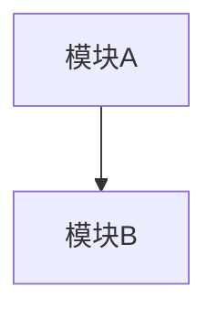

# Ren'Py 项目级 architecture.md 格式规范

此文件定义项目级 `architecture.md` 的输出格式。architecture skill 的 `--init` 和 `--update` 模式按此模板产出。

项目级 architecture.md 描述项目**当前**的完整架构状态。每次 feat 完成后通过 `--update` 合并更新。

## 模板

```markdown
# 项目架构

## 1. 模块关系图

Mermaid flowchart。项目全量模块及其依赖关系。



### 模块职责一览

| 模块 | 职责 | 对应领域概念 |
|------|------|-------------|
| {模块 A} | {一句话职责} | {领域概念} |
| {模块 B} | {一句话职责} | {领域概念} |

## 2. 模块规约

### 2.1 {模块名}

**领域来源：** {领域模式/概念}

**职责：** {一句话}

**技术映射：**
- {Ren'Py 构造} → {领域行为}，理由：{为什么}

**对外接口：**

| 方向 | 接口 | 说明 |
|------|------|------|
| 对外暴露 | {label/screen/回调} | {调用方、参数、时机} |
| 外部依赖 | {模块/数据源} | {获取什么、何时获取} |

**行为契约：** {状态机/生命周期。关键边界行为。}

### 2.2 {模块名}
...

## 3. 运行时视图

核心跨模块流程的 Mermaid 序列图。

## 4. 跨模块约定

全量累积的模块间协作规则。

- 约定 1：说明
- 约定 2：说明
```

---

## 内容规则

**必须遵守：**
- 技术映射标注理由
- 对外接口标注调用方和时机
- 不写 feat-N 标注——项目级始终反映当前状态，不是变更日志

**禁止内容：**
- 引擎无关的领域分析
- Screen 内部实现细节
- RPY 代码片段
