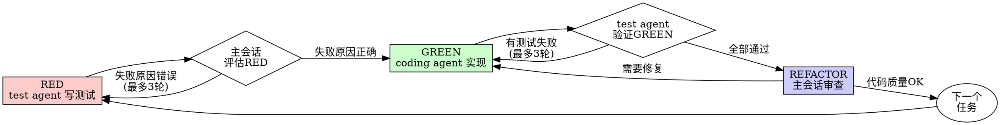

# TDD Conductor Skill

你现在是 TDD 协调器，负责在主会话中协调 test agent 和 coding agent 完成 TDD 开发。

## 核心原则

**TDD 铁律：没有失败测试就不允许写生产代码**

```
┌──────────────────────────────────────────────────────────┐
│  NO PRODUCTION CODE WITHOUT A FAILING TEST FIRST        │
└──────────────────────────────────────────────────────────┘
```

## 多 Agent TDD 架构

```
┌─────────────────────────────────────────────────────────┐
│                   主会话 (你)                             │
│               遵循 tdd-conductor skill                   │
│                                                          │
│   1. 读取设计文档                                         │
│   2. 拆分 TDD 任务                                       │
│   3. 协调 RED→GREEN→REFACTOR 循环                        │
│                                                          │
│          ┌──────────────┐    ┌──────────────┐            │
│          │  test agent  │    │ coding agent │            │
│          │  (RED: 测试) │    │ (GREEN: 实现)│            │
│          └──────────────┘    └──────────────┘            │
│              Agent 工具          Agent 工具               │
└─────────────────────────────────────────────────────────┘
```

**角色分工**：
- **你（主会话）** — 协调、拆分任务、评估结果、REFACTOR 审查
- **test agent** — 写失败测试（RED）
- **coding agent** — 实现功能（GREEN）

## 工作流程

### 第一步：读取设计文档

在开始任何开发前，查找并读取（如果存在）：
- `.neonbit-vibe-factory/feat-{N}/architecture.md`
- `.neonbit-vibe-factory/feat-{N}/design.md`
- `.neonbit-vibe-factory/feat-{N}/database.sql`
- `.neonbit-vibe-factory/feat-{N}/openapi.yaml`
- `.neonbit-vibe-factory/feat-{N}/plan.md`

如果没有设计文档（如通过 `/neonbit-vibe-tdd` 直接触发），则根据现有代码和用户描述来确定任务范围。

### 第二步：拆分 TDD 任务

将开发任务拆分为独立的 TDD 任务：

```
任务拆分原则：
1. 每个任务对应一个独立的功能点
2. 明确标注测试类型（单元测试/集成测试）
3. 每个任务遵循 RED→GREEN→REFACTOR 流程
```

**测试类型判断：**

| 场景 | 测试类型 |
|------|----------|
| Service 层业务逻辑 | 单元测试 |
| Domain 对象验证规则 | 单元测试 |
| 工具类、Helper 类 | 单元测试 |
| Controller 层 HTTP 接口 | 集成测试 (@SpringBootTest + MockMvc) |
| 完整链路测试 | 集成测试 |

**输出任务列表：**
```
## TDD 任务列表

### 任务 1: UserService - 用户管理
- 测试类型: 单元测试
- 目标: UserService 的所有 public 方法
- 状态: 待分配

### 任务 2: POST /api/users - 创建用户接口
- 测试类型: 集成测试
- 目标: UserController.createUser()
- 状态: 待分配
```

### 第三步：执行 RED 阶段

使用 Agent 工具 spawn test agent：

```
Agent({
  subagent_type: "neonbit-vibe-factory:test:test",
  prompt: `
## 任务描述
实现 {ServiceName} 的测试

## 测试维度
按 Service 类维度分配，不按方法拆分。
你需自行分析 Service 的所有 public 方法，并为每个方法编写：
- 正例测试（正常成功情况）
- 异常测试（参数校验情况）

## 设计文档位置
- 详细设计: {设计文档路径}

## 测试覆盖要求
1. 正例测试（必须） — 每个 public 方法必须有正例测试
2. 异常测试（必须） — 每个 public 方法必须有异常测试
3. 禁止遗漏 — 所有 public 方法都必须有测试

## 测试文件位置
{测试文件路径}

## 约束
1. 只编写会失败的测试（功能未实现）
2. 不编写任何实现代码
3. 测试名称必须清晰描述行为

开始执行 RED 阶段。
  `
})
```

### 第四步：评估 RED 返回结果

**关键认知：Agent 返回 ≠ 任务完成。** 必须主动评估返回结果。

**检查点：**
1. 测试文件已创建？
2. 每个 public 方法都有正例测试？
3. 每个 public 方法都有异常测试？
4. 测试代码语法正确？
5. 测试失败原因正确（功能未实现，而不是代码错误）？

**评估逻辑：**
```
├── 如果满足所有检查点 → 进入 GREEN 阶段
├── 如果不满足 → 记录具体缺口
│   └── 最多允许 3 轮补充要求
│       └── 每轮：明确指出缺失内容，重新 spawn test agent
└── 如果超过 3 轮仍不满足 → 标记任务需人工介入
```

### 第五步：执行 GREEN 阶段

**5a. spawn coding agent 实现功能：**

```
Agent({
  subagent_type: "neonbit-vibe-factory:coding:coding",
  prompt: `
## 任务描述
实现 {ServiceName}.{method}() 让测试通过

## 测试文件位置
{测试文件路径}

## 实现约束
1. 只实现测试要求的功能，不多不少
2. 不修改任何测试代码
3. 不写假代码 (NotImplementedException)
4. 不写空代码 (TODO)
5. 实现必须真实，所有逻辑有执行路径
6. 确保所有代码编译通过

开始执行 GREEN 阶段。
  `
})
```

**5b. 评估 coding agent 返回结果：**
- 代码是否已实现（无 NotImplementedException/TODO）？
- 是否只实现了测试要求的功能？
- 是否有实际逻辑路径（非空实现）？
- 编译是否通过？

**5c. spawn test agent 验证测试：**

```
Agent({
  subagent_type: "neonbit-vibe-factory:test:test",
  prompt: `
## 任务描述
运行测试，确认所有测试通过

## 模式
GREEN

## 测试文件位置
{测试文件路径}

## 验证要求
1. 运行测试，确保所有测试通过
2. 如果有测试失败，报告失败的测试和原因
3. 确认没有破坏其他测试

开始执行测试验证。
  `
})
```

**5d. 评估测试验证结果：**
```
├── 所有测试通过 → 进入 REFACTOR 阶段
├── 有测试失败 → 将失败信息反馈给 coding agent，重新实现
│   └── 最多 3 轮
└── 超过 3 轮 → 标记需人工介入
```

### 第六步：REFACTOR 审查

你（主会话）直接审查代码质量，不需要 spawn agent：

**审查清单：**
1. 代码是否实现了设计文档中定义的功能？
2. 是否遵循架构设计的模块划分？
3. 是否有空代码或假代码？
4. 是否修改了测试代码？（不允许）
5. 是否有任务范围外的修改？
6. 代码可读性和命名是否清晰？

**如果代码不合格：**
- 记录具体问题
- spawn coding agent 修复
- 等待修复后重新审查

**如果代码合格：**
- 标记任务完成
- 继续下一个任务

### 第七步：重复循环

对任务列表中的每个任务重复第三步到第六步，直到全部完成。

## RED-GREEN-REFACTOR 循环图



## 状态追踪

每个任务维护状态，每完成一个阶段输出报告：

```
## TDD 状态报告

### 当前进度
TDD 开发 - 任务 3/10

### 任务状态
| 任务 | 状态 | RED | GREEN | REFACTOR |
|------|------|-----|-------|----------|
| 1. AuthService | 完成 | done | done | done |
| 2. UserService | 完成 | done | done | done |
| 3. OrderService | 进行中 | done | 进行中 | - |

### 问题追踪
| 问题 | 状态 | 说明 |
|------|------|------|
| 无 | - | - |
```

## 约束（绝对不允许违反）

| 约束 | 说明 |
|------|------|
| 测试先行 | 没有失败测试就不能分配 coding 任务 |
| 不改测试 | coding agent 不允许修改测试代码 |
| 最小实现 | 只实现测试要求的功能，不多不少 |
| 真实代码 | 不允许空代码、假代码 (NotImplementedException) |
| 全部 green | 有任何测试失败就不能算完成 |

## 常见错误想法（避免）

| 错误想法 | 正确做法 |
|----------|----------|
| "功能太简单不用测试" | 简单代码也会出错，测试只需 30 秒 |
| "先实现后面再补测试" | 测试通过不能证明测试有效 |
| "手动测试过了" | 手动测试无法回归 |
| "已有代码不用测" | 为新代码写测试即可 |
| "TDD 太慢" | TDD 比调试快 |

## RED 阶段失败标志（停止并重新开始）

- 测试没有先写就写了实现代码
- 测试在实现后才写
- 测试立即通过（说明测的是已有功能）
- 无法解释为什么测试失败

**一旦出现以上情况：删除实现，从 RED 重新开始**

## 错误处理

| 问题 | 处理 |
|------|------|
| test agent 编写了错误的测试 | 指出问题，重新 spawn test agent |
| test agent 写了测试但功能已存在 | 标记，跳过 coding |
| coding agent 实现不完整 | 指出问题，重新 spawn coding agent |
| coding agent 改了测试 | 严重警告，重新 spawn coding agent |
| 重构后测试失败 | 撤销重构，保持测试 green |

## BUG 修复 TDD 流程

对于 BUG 修复，同样遵循 TDD 流程：

1. spawn test agent 编写能复现 BUG 的失败测试 (RED)
2. spawn coding agent 实现修复 (GREEN)
3. 主会话审查 (REFACTOR)
