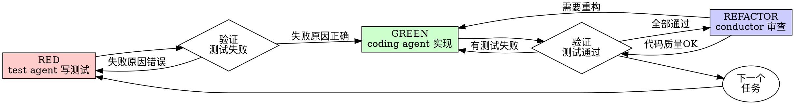

# Test-Driven Workflow Skill (多 Agent 版本)

基于 superpowers:test-driven-development 改造的多 agent 协作 TDD 流程。

## 与原始 TDD 的区别

| 原始 (单人) | 新版 (多 Agent) |
|-------------|-----------------|
| 一个人完成 RED→GREEN→REFACTOR | test agent → RED |
|                                   | coding agent → GREEN |
|                                   | conductor → REFACTOR + 协调 |

## 核心原则

**TDD 铁律：没有失败测试就不允许写生产代码**

```
┌──────────────────────────────────────────────────────────┐
│  NO PRODUCTION CODE WITHOUT A FAILING TEST FIRST        │
└──────────────────────────────────────────────────────────┘
```

违反这条铁律等同于违反 TDD 的精神。

## 多 Agent TDD 流程

```
┌─────────────┐     ┌─────────────┐     ┌─────────────┐
│  conductor  │     │  test agent │     │ coding agent│
└──────┬──────┘     └──────┬──────┘     └──────┬──────┘
       │                    │                    │
       │  1. 分配测试任务    │                    │
       │───────────────────>│                    │
       │                    │                    │
       │                    │  2. RED: 写失败测试 │
       │                    │                    │
       │    3. 提交测试代码   │                    │
       │<───────────────────│                    │
       │                    │                    │
       │  4. 分配实现任务     │                    │
       │──────────────────────────────────────────>│
       │                    │                    │
       │                    │                    │  5. GREEN: 实现功能
       │                    │                    │
       │    6. 提交实现代码   │                    │
       │<─────────────────────────────────────────│
       │                    │                    │
       │  7. 审查代码         │                    │
       │  (REFACTOR)         │                    │
       │                    │                    │
       ▼                    ▼                    ▼
```

### 阶段 1: RED (test agent)

**触发条件**: conductor 分配测试任务

**执行步骤**:
1. 解析任务（目标类、测试类型、功能点）
2. 检查现有代码（理解类结构、业务逻辑）
3. 编写失败测试（单元测试或集成测试）
4. 验证测试失败（确认是因为功能未实现）
5. 提交给 conductor

**输出**: 测试代码文件 + 状态报告

### 阶段 2: GREEN (coding agent)

**触发条件**: conductor 分配实现任务

**执行步骤**:
1. 接收任务（目标类、测试文件位置）
2. 阅读测试（理解期望行为）
3. 实现功能（最小化实现，不多不少）
4. 验证 GREEN（所有测试通过）
5. 提交给 conductor

**输出**: 实现代码 + 测试结果

### 阶段 3: REFACTOR (conductor)

**触发条件**: coding agent 完成实现

**执行步骤**:
1. 审查代码质量
2. 检查是否遵循设计文档
3. 确保没有破坏其他测试
4. 必要时要求重构
5. 进入下一个任务

**输出**: 审查结果 + 下一个任务分配

## RED-GREEN-REFACTOR 循环图



## 测试类型判断

### 单元测试场景
- Service 层业务逻辑
- Domain 对象的验证规则
- 工具类、Helper 类
- 业务规则（状态转换、计算逻辑）

### 集成测试场景
- Controller 层 (HTTP 接口)
- 需要启动 Spring 上下文
- 测试完整链路 (Controller → Service → Repository)
- 数据库交互

##conductor 的协调职责

1. **任务分配**
   - 将执行计划拆分为具体任务
   - 判断每个任务需要什么测试类型
   - 分配给 test agent (RED) 或 coding agent (GREEN)

2. **循环管理**
   - 确保 RED → GREEN → REFACTOR 顺序
   - 测试失败时打回 coding agent
   - 代码质量问题时要求重构

3. **状态追踪**
   - 记录每个任务的 TDD 状态
   - 追踪 RED 失败次数
   - 确保所有任务完成后再进入下一阶段

## 约束（绝对不允许违反）

| 约束 | 说明 |
|------|------|
| 测试先行 | 没有失败测试就不能分配 coding 任务 |
| 不改测试 | coding agent 不允许修改测试代码 |
| 最小实现 | 只实现测试要求的功能，不多不少 |
| 真实代码 | 不允许空代码、假代码 (NotImplementedException) |
| 全部 green | 有任何测试失败就不能算完成 |

## 常见 Rationalizations (避免)

| 错误想法 | 正确做法 |
|----------|----------|
| "功能太简单不用测试" | 简单代码也会出错，测试只需 30 秒 |
| "先实现后面再补测试" | 测试通过不能证明测试有效 |
| "手动测试过了" | 手动测试无法回归 |
| "已有代码不用测" | 为新代码写测试即可 |
| "TDD 太慢" | TDD 比调试快 |

## RED 阶段失败标志（停止并重新开始）

- 测试没有先写就写了实现代码
- 测试在实现后才写
- 测试立即通过（说明测的是已有功能）
- 无法解释为什么测试失败

**一旦出现以上情况：删除实现，从 RED 重新开始**

## 验证清单 (conductor 审查时)

- [ ] 每个新功能都有测试
- [ ] 每个测试在实现前都失败过
- [ ] 每个测试失败原因正确（功能未实现，不是测试错误）
- [ ] coding agent 写的是最小代码
- [ ] 所有测试通过
- [ ] 没有破坏其他测试
- [ ] 测试名称清晰描述行为

## 使用场景

### 场景 1: 后端开发阶段

```
conductor 调用 orchestrator
  → orchestrator 调用 test-driven-workflow skill
  → conductor 分配任务给 test agent (RED)
  → test agent 完成测试
  → conductor 分配任务给 coding agent (GREEN)
  → coding agent 完成实现
  → conductor 审查 (REFACTOR)
  → 循环直到所有任务完成
```

### 场景 2: BUG 修复

```
收到 BUG: 邮箱验证失败
→ conductor 分配任务给 test agent
→ test agent 编写能复现 BUG 的失败测试 (RED)
→ test agent 验证测试失败
→ conductor 分配任务给 coding agent
→ coding agent 实现修复
→ coding agent 验证 GREEN
→ conductor 审查通过
→ BUG 修复完成，防止回归
```

## 错误处理

| 问题 | 处理 |
|------|------|
| test agent 编写了错误的测试 | conductor 打回，test agent 重写 |
| test agent 写了测试但功能已存在 | conductor 标记，跳过 coding |
| coding agent 实现不完整 | conductor 打回，补充实现 |
| coding agent 改了测试 | conductor 严重警告，打回重做 |
| 重构后测试失败 | 撤销重构，保持测试 green |

## 输出格式

每个任务完成后的标准状态报告：

```
## TDD 任务状态报告

### 任务
- 目标: {class}.{method}()
- 状态: [RED|GREEN|REFACTOR|COMPLETED]

### 测试覆盖
- 测试文件: {path}
- 测试用例数: {n}
- 失败测试数: {n} (RED 时)
- 通过测试数: {n} (GREEN 时)

### 代码质量
- 最小实现: [✓/✗]
- 无假代码: [✓/✗]
- 测试隔离: [✓/✗]

### 下一步
- {next action}
```

## 与原始 superpowers:tdd 的关系

此 skill 是原始 TDD 技能的多 agent 扩展：

1. **保留核心原则** — 测试先行、RED-GREEN-REFACTOR、最小实现
2. **拆分了执行角色** — test agent 负责 RED，coding agent 负责 GREEN
3. **增强了协调能力** — conductor 作为主协调器确保流程正确
4. **保留了所有约束** — 铁律、反 rationalizations、验证清单

**当你使用此 skill 时，实际上是在执行完整的 TDD 流程，只是由多个 agent 协作完成。**